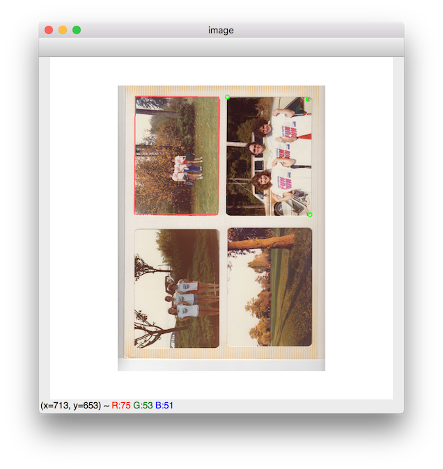

Tools for simplifying the process of scanning photo albums with minimal effort.

## Scanning

Download the scanline command from here https://github.com/klep/scanline and
add to your `PATH`

Use this script which will prompt to press enter for each scanned page and 
automatically number the output.

Note: Will scan to the current directory, so `cd` into an appropriate directory
and run the script from there.

[Link to scan.sh](scan.sh)

```
#!/bin/bash

if [[ -z $BOOK ]]; then
  echo -n "Book: "
  read -r BOOK
  BOOK=$(printf '%02d' "$BOOK")
fi

if [[ -z $PAGE ]]; then
  echo -n "Starting Page: "
  read -r PAGE
fi

while true; do
  NAME="book${BOOK}_page$(printf '%03d' ${PAGE})"
  echo "Scanning page $NAME"
  scanline -a4 -flatbed -dir "$(pwd)" -resolution 600 -jpeg -name $NAME
  PAGE=$(($PAGE + 1))

  echo -n " == Enter to start page $PAGE: "
  read
done
```

Example output:

```
$ ../scan.sh
Book: 8
Starting Page: 39
Scanning page book08_page039
Starting scan...
Done
 == Enter to start page 40:
Scanning page book08_page040
Starting scan...
Done
 == Enter to start page 41:
Scanning page book08_page041
Starting scan...
...
```

## Splitting

The scan step takes full `a4` sized scans of your flatbed. The next step is to split those scans up into individual photos.

There are automatic tools that can do this task [example split.sh](split.sh), but I've found it difficult to get it 100%, especially when scanning photos without removing them from the album page so there isn't a perfect white background.

Instead here is a custom tool written in Python with OpenCV to do the splitting
with some manual assistance

[Link to split.py](split.py)

### Usage:

`cd` into the directory where output files should be placed

Run `split.py` and pass all scanned images to split as arguments

```
../split.py ../scans/*.jpg
```

An OpenCV window will open.

- Click each of the 4 corners of the photo to place a marker there
- On the last corner, hold down the mouse to visualize the cropping rectangle
- The rectangle will be the smallest possible rectangle which contains all of the points (your markers might not be perfectly at the corners, but they will be contained)
- When the photo is ready, press `spacebar` to finalize that photo
- Repeat on the next photo until all are set
- When all photos are ready. Press `enter` to save the photos to disk and load the next photo

Other controls:

- `backspace` to undo the last marker or cropping rectange
- `b` to go back to previous photo
- `n` to go to the next photo
- `q` or `esc` to quit

